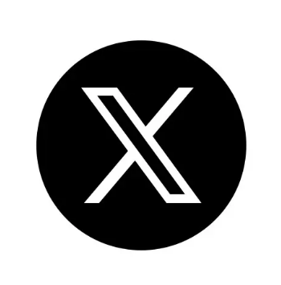

### *I’m a Full Stack Web Developer and Computer Science Student.  I build full-stack projects, contribute to open source, and organize workshops and hackathons.*
 

---

  <!-- LinkedIn -->
  
  <!-- X (Twitter) -->
  
  <!-- Email -->
  
  <!-- Hashnode -->
  

---

## Tech Stack:

<table>
  <tr>
    <th>Category</th>
    <th>Technologies / Tools</th>
  </tr>

  <tr>
    <td><b>Languages</b></td>
    <td>
      
      
      
      
      
    </td>
  </tr>

  <tr>
    <td><b>Frameworks & Libraries</b></td>
    <td>
      
      
      
      
      
      
      
    </td>
  </tr>

  <tr>
    <td><b>Databases & Authentication</b></td>
    <td>
      
      
      
      
    </td>
  </tr>

  <tr>
    <td><b>Deployment & API Tools</b></td>
    <td>
      
      
    </td>
  </tr>

  <tr>
    <td><b>IDEs & Productivity</b></td>
    <td>
      
      
      
    </td>
  </tr>

  <tr>
    <td><b>Version Control & Design</b></td>
    <td>
      
      
      
    </td>
  </tr>
</table>

---

## GitHub Stats:

 

### 🔝 Top Contributed Repo

---

### Visit My Blog on Hashnode

  
  

